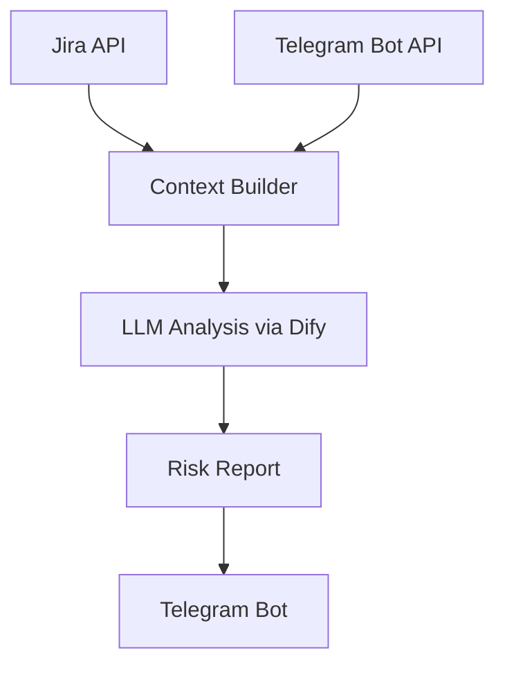

# ARGUS — AI Project Risk Analyzer

ARGUS — это AI-ассистент, который анализирует состояние проекта и выявляет потенциальные риски срыва сроков.

Система объединяет данные из рабочих инструментов команды (Jira и Telegram) и с помощью LLM анализирует:

- динамику задач
- обсуждения команды
- признаки блокеров
- зависимости между разработчиками

ARGUS формирует автоматический **ежедневный отчёт о состоянии проекта**.

---

# Архитектура

ARGUS построен как pipeline анализа проектных данных.

---

# Основные возможности

• Анализ метаданных задач Jira  
• Анализ обсуждений команды  
• Выявление зависимостей между разработчиками  
• Предиктивный анализ рисков проекта  
• Автоматическая генерация отчёта  

---

## Пример отчёта

🤖 ARGUS — утренний анализ проекта

📊 Общий риск проекта: 🟠 40%

🎯 Риски по задачам

SOFTCOMPANY-70703 — 40%
Интеграция нового сценария бота с API 1С

Причина: ожидание информации от разработчика.

🚀 Итог:

Проект находится в стабильном состоянии, однако есть зависимость от внешней информации.

---

# Технологический стек

Backend

- Python
- requests
- python-docx

Интеграции

- Jira REST API
- Telegram Bot API
- Dify API (LLM workflows)

Хранение данных

- JSON

---

# Как работает система

1. ARGUS получает данные из Jira (задачи, статусы, комментарии).
2. Telegram-бот собирает обсуждения команды.
3. Система формирует контекст проекта.
4. LLM анализирует контекст и выявляет риски.
5. ARGUS отправляет отчёт в Telegram.

---

# Запуск проекта

Установить зависимости
pip install -r requirements.txt

Запустить систему
python src/argus.py

---

# Roadmap

Планируемые улучшения:

- анализ Git commit activity
- обнаружение зависших задач
- анализ загрузки разработчиков
- визуализация рисков проекта

---

# Автор

Юлия Неверова  
PL/SQL developer

---

# Лицензия

MIT
