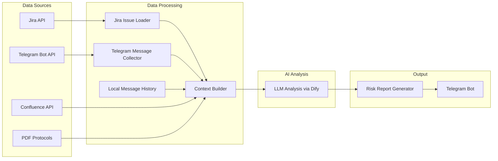

# ARGUS — AI Project Risk Analyzer

ARGUS — это AI-ассистент, который анализирует состояние проекта и выявляет потенциальные риски срыва сроков.


Система объединяет данные из рабочих инструментов команды:

- Jira (задачи и метаданные)
- Telegram (коммуникация команды)
- Confluence (документация проекта)
- PDF-протоколы встреч

и с помощью LLM анализирует:

- динамику задач
- обсуждения команды
- признаки блокеров
- зависимости между разработчиками
- системные проблемы проекта

ARGUS формирует автоматический **ежедневный отчёт о состоянии проекта**.

---

# Архитектура

ARGUS построен как pipeline анализа проектных данных.

## Architecture


```mermaid
flowchart LR

subgraph Data Sources
Jira[Jira API]
Telegram[Telegram Bot API]
Confluence[Confluence API]
PDF[PDF Protocols]
end

subgraph Data Processing
Loader[Jira Issue Loader]
Collector[Telegram Message Collector]
History[Local Message History]
Context[Context Builder]
end

subgraph AI Analysis
LLM[LLM Analysis via Dify]
end

subgraph Output
Report[Risk Report Generator]
Bot[Telegram Bot]
end

Jira --> Loader
Telegram --> Collector

Loader --> Context
Collector --> Context
History --> Context
Confluence --> Context
PDF --> Context

Context --> LLM
LLM --> Report
Report --> Bot
```
---

# Основные возможности

• Сбор данных из Jira, Telegram, Confluence  
• Контекстный анализ проекта с помощью AI  
• Выявление рисков и скрытых проблем  
• Генерация управленческих инсайтов  
• Автоматический отчёт в Telegram  

---

## Пример отчёта

🤖 ARGUS — утренний анализ проекта

☀️ Доброе утро, команда!

📊 Общий риск проекта: 🟠 60%

🎯 Риски по задачам:

🔗 4 задач(-и) — Нет активности и коммуникации по задаче:
ORCPSE-4942 (https://jira.eltc.ru/browse/ORCPSE-4942), ORCPSE-4363 (https://jira.eltc.ru/browse/ORCPSE-4363), ORCPSE-4166 (https://jira.eltc.ru/browse/ORCPSE-4166), ORCPSE-3271 (https://jira.eltc.ru/browse/ORCPSE-3271)

🔗 3 задач(-и) — Нет активности по задаче:
ORCPSE-4921 (https://jira.eltc.ru/browse/ORCPSE-4921), ORCPSE-4774 (https://jira.eltc.ru/browse/ORCPSE-4774), ORCPSE-3272 (https://jira.eltc.ru/browse/ORCPSE-3272)


🚀 Итог:

В проекте наблюдаются риски из-за отсутствия активности и комментариев по нескольким ключевым задачам, что указывает на потенциальные задержки и недовольство команды. Основное внимание следует уделить синхронизации с исполнителями для выяснения причин.

📊 Распределение задач по статусам:

• In Progress: 82%
• Планирование: 9%
• Приемка: 9%


🧭 Рекомендации менеджеру

• Синхронизироваться с исполнителями по задачам, чтобы выяснить причины задержки и предложить помощь.

────────────────────

💬 Цитата дня от Argus

Запомни: всего одна ошибка – и ты ошибся.

---

# Технологический стек

Backend

- Python
- requests
- pdfplumber
- beautifulsoup4

Интеграции

- Jira REST API
- Telegram Bot API
- Confluence REST API
- Dify (self-hosted LLM workflow platform)

Хранение данных

- JSON

---

# Как работает система

1. ARGUS получает данные из Jira (задачи, статусы, комментарии).
2. Telegram-бот собирает обсуждения команды.
3. Система формирует контекст проекта.
4. LLM анализирует контекст и выявляет риски.
5. ARGUS отправляет отчёт в Telegram.

---

## Дополнительная логика анализа

ARGUS использует несколько уровней анализа:

- Rule-based анализ (эвристики по задачам Jira)
- Анализ коммуникации (Telegram)
- Контекстный анализ документации (Confluence)
- AI-анализ через LLM (Dify)

Это позволяет выявлять не только явные, но и скрытые риски проекта.

---

# Запуск проекта

## 1. Запуск Dify (LLM-движок анализа)

ARGUS использует workflow в Dify для анализа проектных рисков.

Запустить Dify можно через Docker:

```bash
git clone https://github.com/langgenius/dify.git
cd dify/docker
docker compose up -d
```

После запуска API будет доступен по адресу:

```
http://localhost/v1/workflows/run
```

---

## 2. Импорт workflow анализа

Экспорт workflow находится в репозитории:

```
dify/project-risk-predictor.yml
```

Импортировать его можно в интерфейсе Dify:

```
Workflow → Import DSL
```

После импорта будет создан workflow анализа рисков проекта,
используемый ARGUS для обработки контекста задач и обсуждений команды.

---

## 3. Установка зависимостей

```bash
pip install -r requirements.txt
```
---

## 4. Настройка переменных окружения

Создайте файл `.env` на основе `.env.example`:

```bash
cp .env.example .env
```

---

## 5. Запуск ARGUS

```bash
python -m src.main
```

---

## Автозапуск

ARGUS может работать в автоматическом режиме через планировщик задач.

Важно: требуется активное VPN-подключение к корпоративной сети.

---

# Автор

Юлия Неверова  
PL/SQL developer

---

# Лицензия

MIT
